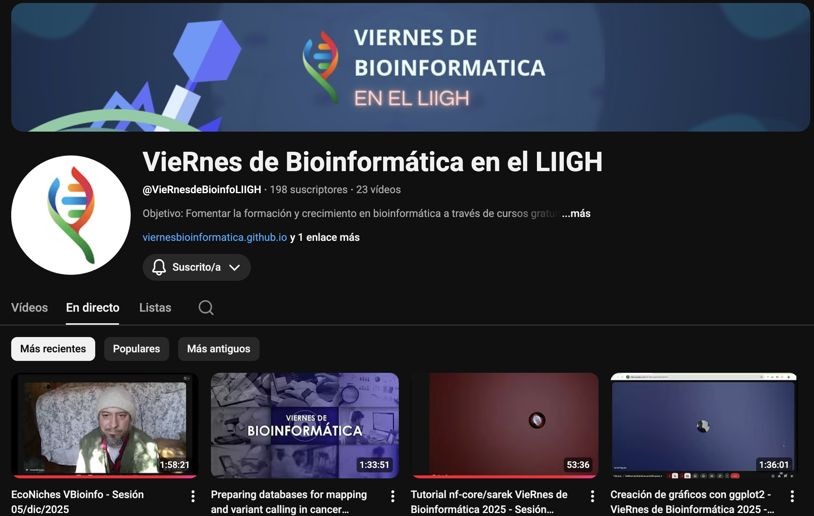
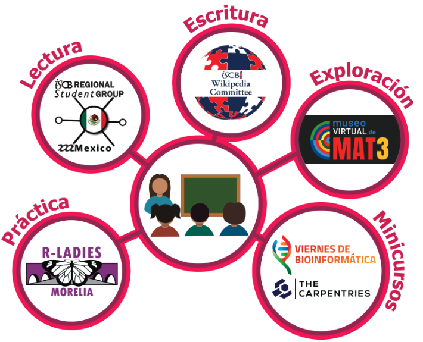
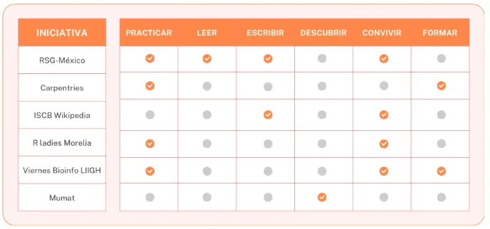

```{r setup, include = FALSE}
# Setup chunk
# Paquetes a usar
#options(htmltools.dir.version = FALSE) cambia la forma de incluir código, los colores

library(knitr)
library(tidyverse)
library(xaringanExtra)
library(icons)
library(fontawesome)
library(emo)
library(countdown) # remotes::install_github("gadenbuie/countdown", subdir = "r"), Explicacion de su uso: https://pkg.garrickadenbuie.com/countdown/#5
library(palmerpenguins)

# set default options
opts_chunk$set(collapse = TRUE,
               dpi = 300,
               warning = FALSE,
               error = FALSE,
               comment = "#")

top_icon = function(x) {
  icons::icon_style(
    icons::fontawesome(x),
    position = "fixed", top = 10, right = 10
  )
}

knit_engines$set("yaml", "markdown")

# Con la tecla "O" permite ver todas las diapositivas
xaringanExtra::use_tile_view()
# Agrega el boton de copiar los códigos de los chunks
xaringanExtra::use_clipboard()

# Crea paneles impresionantes 
xaringanExtra::use_panelset()

# Para compartir e incrustar en otro sitio web
xaringanExtra::use_share_again()
xaringanExtra::style_share_again(
  share_buttons = c("twitter", "linkedin")
)

# Funcionalidades de los chunks, pone un triangulito junto a la línea que se señala
xaringanExtra::use_extra_styles(
  hover_code_line = TRUE,         #<<
  mute_unhighlighted_code = TRUE  #<<
)

# Agregar web cam
xaringanExtra::use_webcam()

# barra de progreso
xaringanExtra::use_progress_bar(color = "#0051BA", location = "top", height = "10px")
```

```{r xaringan-editable, echo=FALSE}
# Para tener opciones para hacer editable algun chunk
xaringanExtra::use_editable(expires = 1)
# Para hacer que aparezca el lápiz y goma
xaringanExtra::use_scribble()
```

```{r xaringan-themer Eve, include=FALSE, warning=FALSE}
# Establecer colores para el tema
library(xaringanthemer)

palette <- c(
 orange        = "#fb5607",
 pink          = "#ff006e",
 blue_violet   = "#8338ec",
 zomp          = "#38A88E",
 shadow        = "#87826E",
 blue          = "#1381B0",
 yellow_orange = "#FF961C"
  )

#style_xaringan(
style_duo_accent(
  background_color = "#FFFFFF", # color del fondo
  link_color = "#562457", # color de los links
  text_bold_color = "#0072CE",
  primary_color = "#01002B", # Color 1
  secondary_color = "#CB6CE6", # Color 2
  inverse_background_color = "#00B7FF", # Color de fondo secundario 
  colors = palette,
  
  # Tipos de letra
  header_font_google = google_font("Barlow Condensed", "600"), #titulo
  text_font_google   = google_font("Work Sans", "300", "300i"), #texto
  code_font_google   = google_font("IBM Plex Mono") #codigo
  #text_font_size = "1.5rem" # Tamano de letra
)

# https://www.rdocumentation.org/packages/xaringanthemer/versions/0.3.4/topics/style_duo_accent
```

class: title-slide, middle, center
background-image: url(figures/HelloWorld_slide1.png) 
background-position: 90% 75%, 75% 75%, center
background-size: 1210px,210px, cover


.center-column[
# `r rmarkdown::metadata$title`
### `r rmarkdown::metadata$subtitle`

####`r rmarkdown::metadata$author` 
#### `r rmarkdown::metadata$date`
]

.left[.footnote[R-Ladies Theme[R-Ladies Theme](https://www.apreshill.com/project/rladies-xaringan/)]]

---

## Como inicio esta idea ...

.pull-left[

Los principales pilares de los Viernes de Bioinformática:

- Retribuir
- Tiempo
- Conocimiento
- Paciencia
- Solidaridad
- Gratitud
]

.pull-right[
> Si he visto más lejos es porque estoy sobre los hombros de gigantes 
> — Isaac Newton.

]


--

.center[
.content-box-blue[
Gracias a cada persona que ha sido parte de este camino. 
Este espacio es nuestra manera de **aprender, compartir y crecer juntos**.
]]

---
background-image: url(figures/liigh_unam_logo.png) 
background-position: 10% 10%
background-size: 10%
class: middle, center


# VieRnes de Bioinformática en el LIIGH
----

**Objetivo**: Fomentar la formación y crecimiento en bioinformática a través de *cursos gratuitos* para toda la *comunidad interesada*.

---

## VieRnes de Bioinformática LIIGH-UNAM

.pull-left[
- Fundado en septiembre 2023
- Organizadores: Dra. Evelia Coss y Dr. Israel Aguilar
- STAFF: Jorge Suazo
- **Impacto internacional** con participantes de países como: Argentina, Bolivia, Chile, Colombia, Costa Rica, El Salvador, Ecuador, Perú, Venezuela, Guatemala, España y Estados Unidos.

Redes sociales: 

- Página web: https://viernesbioinformatica.github.io/

[`r fontawesome::fa("github", height = "2em")`](https://github.com/VieRnesBioinformatica) [`r fontawesome::fa("youtube", height = "2em")`](https://www.youtube.com/@viernesdebioinfoliigh)

]

.pull-right[
```{r, echo=FALSE, out.width='80%', fig.align='center'}
knitr::include_graphics("figures/ViernesBioinfo_logo.png")
```
]

---

## VieRnes de Bioinformática LIIGH-UNAM

.pull-left[
Material y grabaciones:

- VieRnes de Bioinformática [Parte 0](https://github.com/EveliaCoss/ViernesBioinfo2023) - (22 sep - 9 dic, 2023) 
- VieRnes de Bioinformática [Parte 1](https://github.com/EveliaCoss/ViernesBioinfo2024) - (2 feb - 2 de agosto, 2024) 
- VieRnes de Bioinformática [Parte 2](https://github.com/EveliaCoss/ViernesBioinfo2024_parte2) - (7 sep - 6 de dic, 2024) 
- VieRnes de Bioinformática [Parte 3](https://github.com/VieRnesBioinformatica/ViernesBioinfo2025_parte3) - (7 feb - 6 de junio, 2025) 
- VieRnes de Bioinformática [Parte 4](https://github.com/VieRnesBioinformatica/ViernesBioinfo2025_parte4) - (5 sep - 9 de dic, 2025) 
]


.pull-right[
```{r, echo=FALSE, out.width='80%', fig.align='center'}
knitr::include_graphics("figures/ViernesBioinfo_logo.png")
```
]


---

## Temas

.pull-left[
- Introducción a **R, Python y Bash**
- Manipulación de datos (vector, dataframe, matriz)
- El ABC de las **funciones y loops**
- Introducción a **Quarto y Rmarkdown**
- Visualizaciones graficas con **ggplot2**
- **Git + Github**
- **Bioestadistica**
- **Buenas practicas** en bioinformática
- Preparación de data para **GWAS**
- **PCA** en Transcriptómica
- Predicción **miRNAs**
- EcoNiches
]

.pull-right[
```{r, echo=FALSE, out.width='100%', fig.align='center'}
knitr::include_graphics("figures/allison-horst-code-kitchen.png")
```
]


---

## Workshops

.pull-left[
- Workshop. Análisis de datos de **RNA-Seq** (parte 0)
- Nexflow (parte 1)
- Bases para la inferencia **filogenética**, construcción, lectura e interpretación de árboles filogenéticos (parte 2)
- Mini curso de **metagenómica** (parte 3)
- Llamado de **variantes genéticas** (parte 3)
- **Leaving Academia** - Mi camino profesional tras dejar la academia (parte 4)
]

.pull-right[
```{r, echo=FALSE, out.width='100%', fig.align='center'}
knitr::include_graphics("figures/rmarkdown_wizards.png")
```
]

---

## Proyectos de la Comunidad

.pull-left[
- Dr. Jose Luis Tellez - *C. elegans* como modelo de estudio de enfermedades raras y resistencia a antiparasitarios
- Dr. Diego Cortes - Tortugas, lagartijas 
- Dr. Claudia Gonzaga - Enfermedades raras | Variantes estructurales
- Dr. Federico Sánchez - Explorando la historia evolutiva y la genética poblacional en México a través de datos paleogenómicos
]

.pull-right[
```{r, echo=FALSE, out.width='100%', fig.align='center'}
knitr::include_graphics("figures/debugging.jpg")
```
]

---

## VieRnes de Bioinformática LIIGH-UNAM (Parte 4)

- 5 sep - 9 de dic, 2025
- Obtuvimos más de 317 soliictudes distribuidos en: **66.6% México, 14.2% Perú, 10.1% Colombia, 5% Ecuador, 1.6% Bolivia, 0.6% Argentina, 0.3%. Uruguay, Chile, Venezuela, Guatemala, España, Estados Unidos, Italia, Brasil, Nicaragua,** y **El Salvador**. 


.pull-left[
- Rango de edad: **18 a 64 años**
- 10% de los registros corresponden a **profesores investigadores**, 19.9%
estudiantes de **doctorado**, 19.2% **maestría**, 21.1% **licenciatura**.
- Alcanzamos a **166 personas** a través de *Youtube y Google meet*.

]

.pull-right[

```{r, echo=FALSE, out.width='100%', fig.align='center'}

```

]

---

class: center, middle

`r fontawesome::fa("code", height = "3em")`
# Próxima clase: 20 feb - 19 junio, 2026 
## VieRnes de Bioinformática [Parte 5](https://github.com/VieRnesBioinformatica/ViernesBioinfo2026_parte5) 
### 16 clases

---
## VieRnes de Bioinformática (Parte 5)

.pull-left[
Temas:

- Introducción a **R**
- Manipulación de datos (vector y dataframe)
- El ABC de las **funciones**
- Documentación con roxygen
- Introducción a **Quarto** (paginas web)
- Crear presentaciones con **Rmarkdown**
- **Estadística** para datos biológicos
- Visualizaciones graficas con **ggplot2** y **ComplexHeatmap**
]

.pull-right[
```{r, echo=FALSE, out.width='120%', fig.align='center'}
knitr::include_graphics("figures/ggplot2_masterpiece.png")
```
]

---

## Workshops

.pull-left[
- **Workshop. Predicción estructural de proteínas**
  + *Fechas*: 28 y 30 de abril; 5 y 7 de mayo (martes y jueves)
  + *Duración*: 4 horas por sesión
  + *Modalidad*: híbrida (15 personas presencial / 25 virtuales)
  + *Incluye*: coffee break y comida
  + *Lugar*: LIIGH-UNAM

- **The Carpentries: Capacitación de instructures**
  + 2da versión en español
  + *Fechas*: Noviembre
  + *Modalidad*: Presencial
  + *Lugar*: LIIGH-UNAM

]

.pull-right[
```{r, echo=FALSE, out.width='120%', fig.align='center'}
knitr::include_graphics("figures/webeliveinyou.png")
```
]

---

class: inverse, center, middle

`r fontawesome::fa("laptop-file", height = "3em")`
# Comunidades bioinformáticas sin fronteras
### Evelia Lorena Coss-Navarrete, Erika Viridiana Cruz Bonilla y Nelly Sélem Mojica
#### Biotecnología en movimiento, 2025 
#### <https://biotecmov.ibt.unam.mx/numeros/40/6.html>

---

```{r, echo=FALSE, out.width='60%', fig.align='center'}

```

.left[.footnote[.black[
Imagen tomada de: [Comunidades bioinformáticas sin fronteras](https://biotecmov.ibt.unam.mx/numeros/40/6.html)
]]]

---

## Organizaciones gratuitas de difusión

.pull-left[

```{r, echo=FALSE, out.width='100%', fig.align='center'}

```
]

.pull-right[
- [**ISCB-RSG-México**](https://rsg-mexico.iscbsc.org/): Grupo estudiantil, cursos gratuitos y journal club. 
- [**The Carpentries**](https://carpentries.org/): Cursos gratuitos y capacitaciones de instructores.
- [**ISCB Wikipedia - más allá del inglés**](https://en.wikipedia.org/wiki/Wikipedia:WikiProject_Molecular_Biology/Computational_Biology/14th_ISCB_Wikipedia_competition_entries): Mejorar la calidad y cantidad de información disponible en Wikipedia.
- [**R-Ladies Morelia**](https://www.facebook.com/p/R-Ladies-Morelia-100093337606435/): Cursos gratuitos para promover la participación de mujeres y personas de géneros subrepresentados. 
- [**El MUMAT**](https://mumat.matcuer.unam.mx/): Museo Virtual de Matemáticas.
]

.left[.footnote[.black[
Imagen tomada de: [Comunidades bioinformáticas sin fronteras](https://biotecmov.ibt.unam.mx/numeros/40/6.html)
]]]

---

.center[
.content-box-blue[
Gracias a cada persona que ha sido parte de este camino. 
Este espacio es nuestra manera de **aprender, compartir y crecer juntos**.
]]


.left-col[
**Coordinación del LIIGH**

- Dra. Daniela Robles 
- Dr. Federico Sánchez
- Dra. María C. Ávila Arcos 
- Dra. Alejandra Medina
- Eglee Lomelin 
- Luis Aguilar
- Jair Santiago García

**STAFF**

- Dra. Evelia Coss
- Dr. Israel Aguilar
- Jorge Alfredo Suazo 

]

.center-col[
**Instructores**
- Sofia Salazar
- Dr. Domingo Martínez
- Dr. Obed Ramirez
- Dr. Shaday Guerrero
- Dra. Haydeé Peruyero 
- Dra. Joselyn Chávez 
- Oscar Aldana
- Alejandra Schafer
- Jazmín López Chacón
- Quetzally Medina
- Jorge Alfredo Suazo 
- Maria Fernanda Miron Toruno 
- Dra. Aline Pingarroni 
- Sofía Zorrilla Azcué
]

.right-col[
- Maria Jose Palma Martinez
- Johana Galguera
- Dr. David Valle García
- Angélica de Luna García
- Brenda Eloisa Sanchez Pichardo
- María Guadalupe Segovia Ramírez
- Alejandra Paulina Pérez González
- Josué Guzmán Linares
- Andrea Maria Torres Iribe
- Karla Guzmán Barrenechea
- Dr. Alan Michael Torres Calderon
- Armando Sunny
]

---

## Recordatorio: Evento Social

.pull-left[
Viernes 6 de febrero, 15:45h

- **Partido amistoso de Fútbol**
  + Cancha del campus
  
- **Mario Kart Wii**
  + Área de encuentro académico
  
- **Juegos de Mesa**
  + Aula 3
  
- **Búsqueda del Tesoro**
  + Entrada del LIIGH
]

.pull-right[
```{r, echo=FALSE, out.width='120%', fig.align='center'}
knitr::include_graphics("figures/Rproject.png")
```
]

---

class: center, middle

`r fontawesome::fa("code", height = "3em")`
## Gracias por su atención

Respira y coméntame tus dudas. 

```{r, echo=FALSE, out.width='20%', fig.align='right'}
knitr::include_graphics("figures/cat.png")
```
